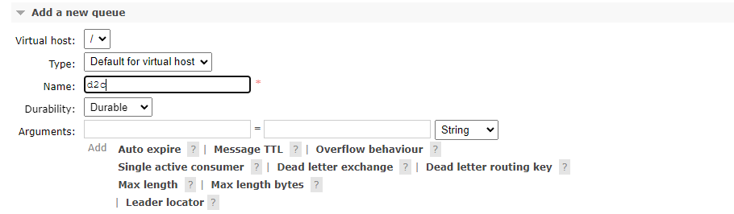
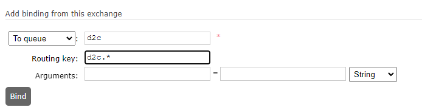

Simple Arduino code for interacting with a MQTT Broker, in this case, with Mercurius. Should be able to deal with symmetric key encryption, heartbeat, processing from the Mercurius Hub and status checks.

### Creating the queue for RabbitMQ:
Create a queue:

Afterwards bind this queue to the amq.topic exchange:

This means that when publishing to a topic, the amq.topic exchange will route everythoing in the format d2c.[anything] into the d2c queue